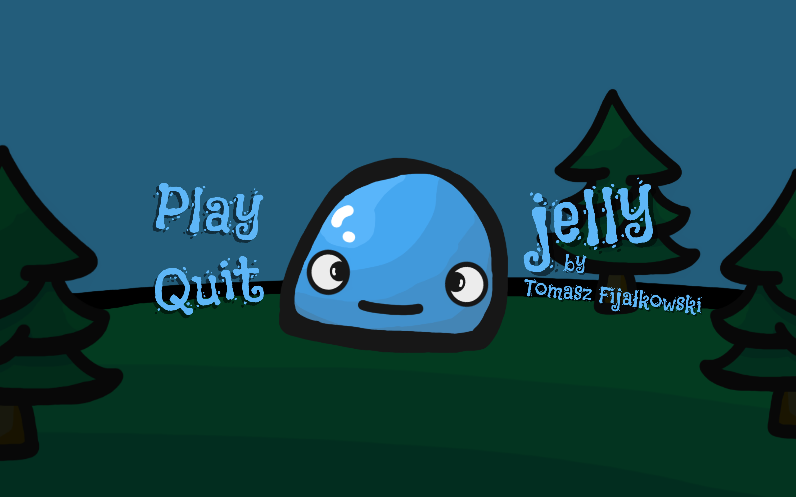

# Jelly

### About project

A virtual pet game written in C#. An individual project made in Unity. The goal is to keep your pet alive by taking care of his needs. It features a few mini games corresponding to each of the pet's needs, like health, energy or hunger.

### Showcase

Main Menu:

Eating Mini Game:

Sleeping Mini Game:

